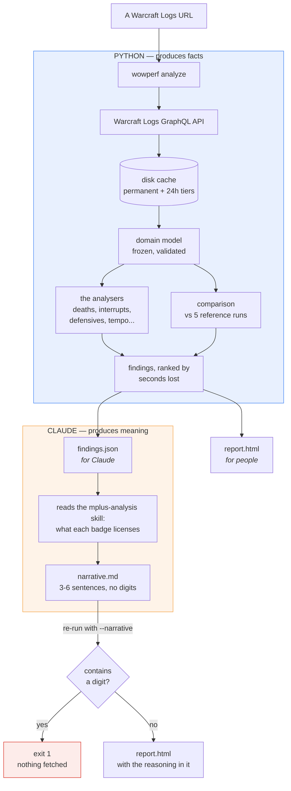
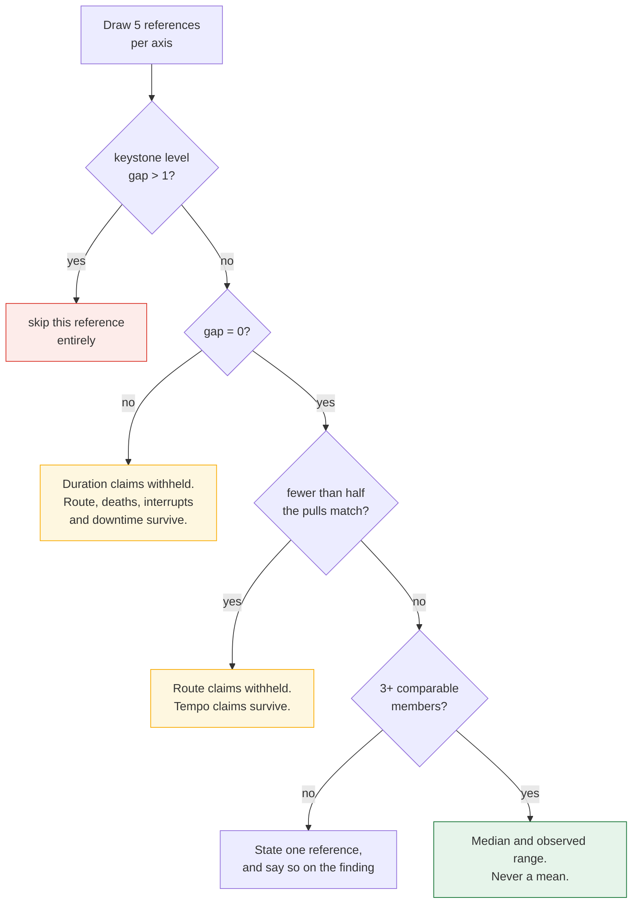
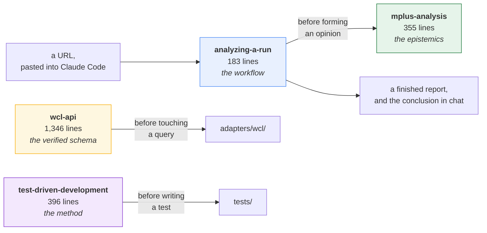
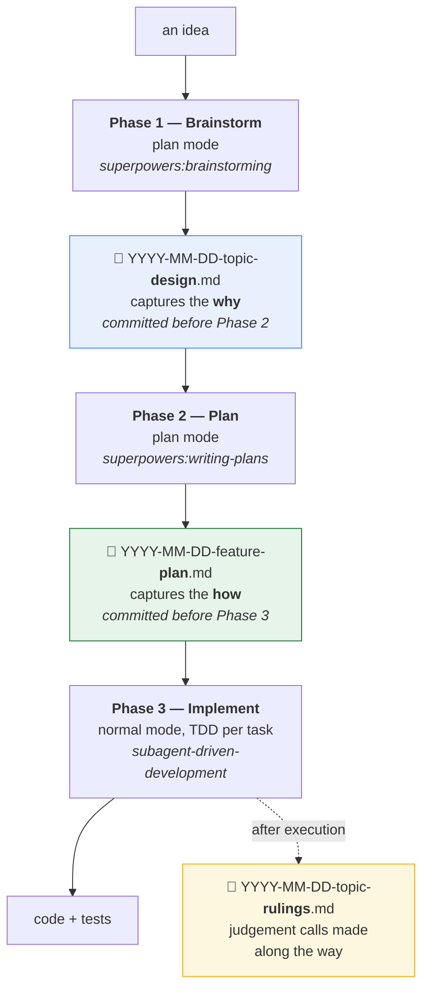
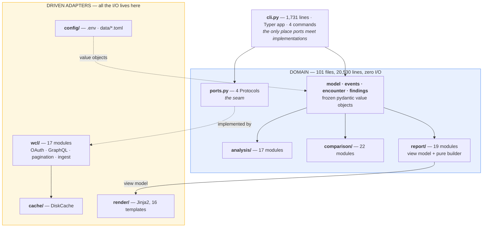
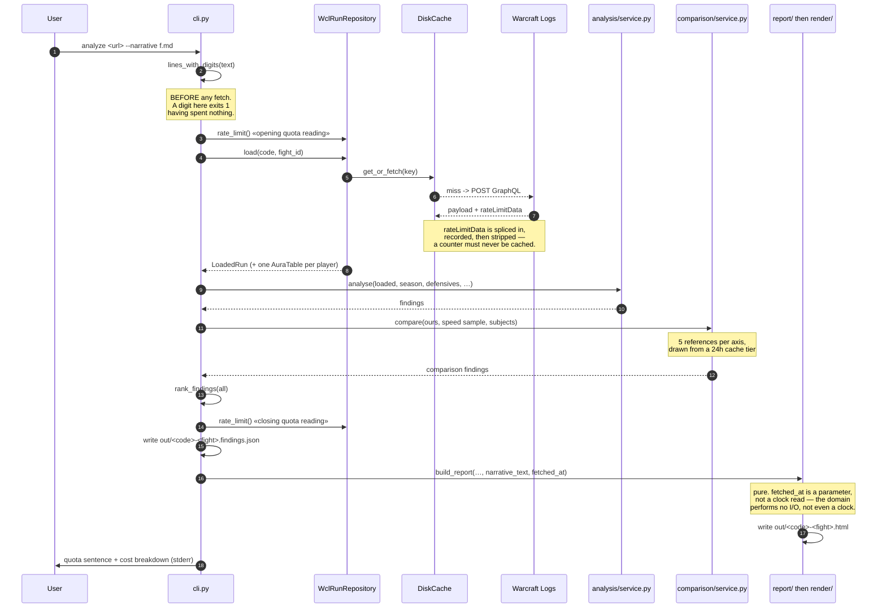
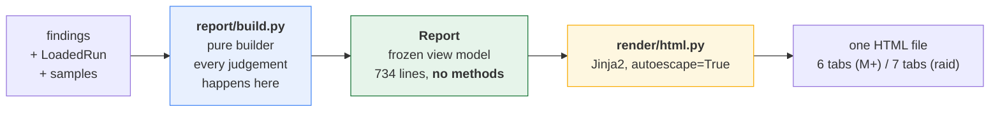
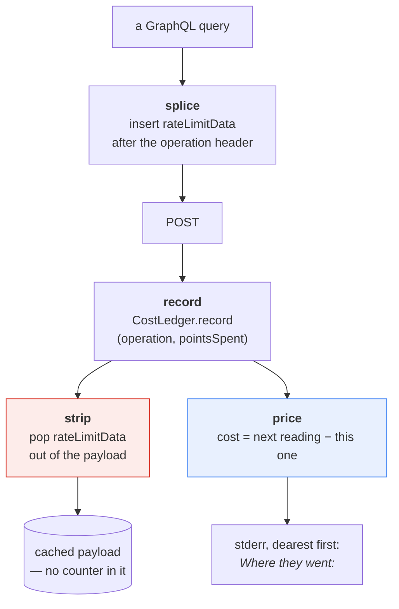
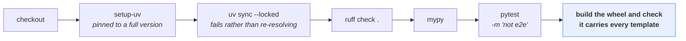

# How this repository works

`wowperf` reads a World of Warcraft combat log and tells a player what to do differently next
time. It is two machines bolted together: a Python program that computes facts, and a language
model that reads those facts and says what they mean. The bolt between them is the interesting
part, and this document is mostly about the bolt.

Part 1 explains the idea and the loop, and needs no knowledge of the code. Part 2 is the map a
contributor needs before changing anything.

---

# Part 1 — The idea and the loop

## The thesis

> **Python produces facts. Claude produces meaning.**
>
> — `docs/plans/2026-09-03-mplus-postmortem-design.md` §8

A coaching tool built on a language model has one dominant failure mode: it invents a number.
"You lost about forty seconds to deaths" is devastating advice when it is true and worthless when
the model made it up, and a reader cannot tell the two apart. Worse, the fabricated version reads
*better* — it is fluent, confident, and specific.

So this repository does not ask the model to be trustworthy. It removes the opportunity.

Every figure — seconds lost, casts per minute, buff uptime, the median of a reference sample —
comes from tested Python. The model never calculates. It reads a JSON file of computed findings
and writes three to six sentences of interpretation, and the tool **refuses that interpretation if
it contains a single digit**. Not "discourages". Refuses, with an exit code, before it spends a
byte of network traffic.

What remains for the model is the job it is actually good at: deciding what matters, in what
order, and how to say it to a human being.

## The pipeline, end to end



Read the loop at the bottom carefully. Claude's output is an **input to rendering**, not something
the template invents. The page stays deterministic: the same findings plus the same narrative
always produce the same HTML.

## Four mechanisms that hold the line

The split above is a promise. These four are what keep it.

### 1. Every finding carries a confidence badge

Three words, defined once as a `StrEnum` in `src/wowperf/domain/findings.py`:

| Badge | Meaning | What a narrative may say |
| --- | --- | --- |
| `measured` | Read from the log, or plain arithmetic over logged facts and dated constants. No assumption that could be wrong. | "was", "cost" — plain assertion |
| `derived` | Reconstructed by a documented rule, or computed with a modelling choice that could be wrong. | "works out to", "on this reckoning" |
| `inferred` | Requires an assumption the log cannot confirm. | "suggests", "looks like" — never a flat claim |

A real run produces **46 findings: 22 `measured`, 17 `derived`, 7 `inferred`**. The badge is a
required field on a frozen model with no default, so a finding constructed without one raises a
validation error. One function builds every badge, deriving both the visible word and the CSS
class from the enum member, so label and colour cannot drift apart. And every badge on the page is
a link to the Provenance tab that explains it.

The point is not tidiness. All three defensive-cooldown findings are `inferred`, because the log
records that an ability was off cooldown and never records that pressing it would have helped. The
badge is what turns *"you should have pressed Barkskin"* into *"you had Barkskin available"* — the
second is true, the first is a guess wearing the clothes of a measurement.

### 2. The digit ban

`analyze --narrative FILE` reads the file, scans it for any character where `isdigit()` is true,
and exits non-zero listing every offending line by number. This happens **first** — before the URL
is parsed, before credentials load, before a single HTTP call. A typo in the path costs nothing,
and a narrative full of numbers can never quietly become a report.

There is no `--allow-digits`. From the design:

> A guardrail with a bypass is a guardrail nobody trusts, and this is the only claim on the page
> with no tested Python behind it.

The most characteristic thing about this check is how carefully it refuses to overclaim. The
design, the function's docstring, and a dedicated unit test named
`test_spelled_out_quantities_pass_because_this_is_a_tripwire_not_a_proof` each say independently
that it catches digits, not dishonesty. A model that writes "about forty seconds" walks straight
through. The skills are what stop that; the tripwire only stops the careless version.

### 3. Findings are ranked, never summed

Adding a ranked list together is the easiest way to produce a confident wrong number, so the
findings file ships a machine-readable warning saying exactly which figures overlap:
`time.gap.*` and `compare.downtime` nest inside `time.residual`; `deaths.single.*`,
`deaths.chain.*` and `deaths.repeat.*` nest inside `deaths.total`; `compare.route.skipped.*`
overlaps the waste `trash.overage` already reports.

That warning string is held in lockstep with the HTML by a test, and the page prints
*"Already counted inside {parent}"* on every nested row. Two audiences, one truth.

A related rule: a finding whose `seconds_lost` is `null` is not a small finding. It is one where no
honest figure exists. Never treat it as zero.

### 4. Withholding beats guessing

The comparison layer measures a run against five fast completions of the same dungeon and five top
parses of the player's specialisation. It refuses to speak whenever the comparison would mislead:



Three details worth naming:

- **Only three statistics exist** in the codebase — median, observed range, and a count phrase.
  There is no mean, so one disaster run cannot speak for a sample.
- **Absence is stated, never implied.** `compare.speed.unavailable` is a real finding. "We asked a
  leaderboard and it answered nothing" is kept distinct from "we never asked".
- **Streams a reference lacks are absent fields, not empty ones.** A speed reference has no `casts`
  attribute at all, so "no casts recorded" cannot be misread as "cast nothing".

## The skills

Four skills ship in `.claude/skills/`, 2,280 lines in total. Three are surfaced to the harness and
fire from their descriptions; one is nested deeper and read on demand.



**`analyzing-a-run`** is the seven-step loop: run the tool, read the JSON, read `mplus-analysis`,
write the narrative, re-run with `--narrative`, hand over the HTML, say the conclusion in chat. Its
sharpest instruction is about the re-run — repeat the first command *exactly* and add only
`--narrative`, because dropping a flag silently changes the cache keys, and therefore both the
quota cost and the subject of the page.

**`mplus-analysis`** governs what may honestly be said. It is deliberately separate from the
workflow so it can answer "why doesn't this rank damage?" with nothing running. It holds the badge
table above, the full nesting list, the worked example of the three inferred defensive findings,
and the section on confounds the comparison *declares rather than corrects* — "because adjusting
would invent a number".

**`wcl-api`** is the largest artefact in the repository at 1,346 lines, and it exists because of a
specific scar:

> This project shipped a half-feature that does nothing because a line said 'verified' and had
> never been run.

Its organising rule is that **every claim carries how it was verified and when**, and a field name
with no date is a defect. Its most valuable sections are the negative findings, whose headings are
themselves the lesson: *"A name does not identify an ability, and an id does not identify a
button"*, *"The debuff half cannot be scoped to one caster"*, *"Warcraft Logs does not attribute a
death to another player"*. It also carries dated cost measurements — a cold sampled analysis at
83.39 points against a projection of ~111 — and the terms of service that forbid warehousing other
people's logs.

**`testing/test-driven-development`** is a vendored copy of the superpowers skill. Accurate on
method; its references to an in-repo hook and a Dagger pipeline describe a toolchain this
repository does not use.

## The skills are tested against the code

This is the sharpest idea in the repository, and it deserves its own heading.

`tests/test_skills.py` treats the Markdown in `.claude/skills/` as code under test:

- It parses the field table out of `wcl-api` and asserts that every field marked *yes* appears in
  `queries.py`, **and** that every field marked *no* is absent. Both directions.
- It diffs every `--flag` the workflow tells you to type against each command's real `--help`, for
  `analyze`, `raid` and `progression` separately.
- It iterates `Finding.model_fields` and asserts each one is enumerated in `mplus-analysis`.

That last test means **adding a field to a Pydantic model fails CI until the prose documents it**.
Documentation rot stops being a matter of discipline and becomes a build error.

The header states the reasoning in one line: *a reference that has quietly drifted from the code is
worse than no reference.*

## How the repository gets built

The code is written by a human and Claude working together, under a three-phase workflow that
insists on artefacts between phases.



The separation exists to protect the context window: planning happens in one session and
implementation in another, so the implementation session carries the plan rather than the whole
argument that produced it.

`docs/plans/` is the fossil record — **56 documents, 16 of them matched design/plan pairs sharing a
date and a topic**.
A fourth artefact type grew later: `-rulings.md`, written *after* execution, recording judgement
rather than specification. There are also `-decision-brief` documents that explicitly decide
nothing ("this document is input to a brainstorm; it decides nothing, approves nothing"), a spike,
a quota measurement, and a defect note.

The scale, for calibration: **582 commits across 14 days, 21 merged pull requests**, and a test
suite of **2,085 tests over 39,000 lines — roughly twice the line count of the source it covers.**

One caveat stated in `CLAUDE.md` and worth repeating: *the plans record intent, not outcome. Their
checkboxes and status lines are unreliable, so the code is the record.*

## `.claude/lessons.md`

A short file with a strict format, written whenever a correction lands:

> Every time RwlRwlRwlRwl corrects a mistake, what gets written here is the **rule** that would have
> avoided it — not the story of the incident. A lesson that cannot be phrased as an imperative is
> not one: it is an anecdote, and it does not belong here.

Six lessons so far. The one that best captures the house style: **"A measurement's method is part
of its claim."** It was written after wrong figures reached `.claude/skills/` and a reviewer caught
them by re-measuring — and its stated scope is *anything written into `.claude/skills/`*.

---

# Part 2 — The code map

## Architecture

Hexagonal, enforced rather than aspired to. **Nothing under `src/wowperf/domain/` imports `httpx`,
`jinja2`, or anything else that touches the network, the disk, or a template.**



Four `Protocol` classes form the boundary, in a 52-line file that imports nothing capable of I/O:

| Protocol | Method | Implemented by |
| --- | --- | --- |
| `RunRepository` | `get(report_code, fight_id) -> Run` | `WclRunRepository` |
| `RankingRepository` | `fastest_runs`, `top_parses` | `WclRankingRepository` |
| `EncounterRankingRepository` | `reference_kills`, `top_parses` | `WclEncounterRankingRepository` |
| `ReportRenderer` | `render(html_path, context) -> None` | **nothing** — see *Rough edges* |

`EncounterRankingRepository` is deliberately a *sibling* of `RankingRepository` rather than a
widening of it. Two protocols make the wrong axis unrepresentable because the method is simply
absent, instead of guarded at runtime.

## Directory map

```
src/wowperf/
├── cli.py                 driving adapter: wires ports, 4 commands (1,731 lines)
├── urls.py                a pasted URL or bare code -> (report_code, fight_id)
├── domain/
│   ├── base.py            Frozen — pydantic BaseModel, frozen=True. Everything below inherits it.
│   ├── model.py           the Mythic+ run as structure: Player, EnemyNpc, Pull, Run, LoadedRun
│   ├── events.py          the run as a sequence: Death, CastEvent, DamageTakenEvent, HealthSample…
│   ├── encounter.py       one raid boss fight: Encounter, LoadedEncounter — a sibling of Run
│   ├── progression.py     a night of attempts on one boss
│   ├── fight.py           LoadedFight Protocol — what both a run and an encounter satisfy
│   ├── findings.py        Finding, FindingFact, Confidence, rank_findings
│   ├── loadout.py         EquippedItem, StatBlock, Loadout
│   ├── auras.py           AuraBand, Aura, PlayerAuras, uptime_seconds_in
│   ├── season.py          value objects for every data/*.toml file
│   ├── slug.py            player_slug — the one place a slug is minted
│   ├── ports.py           the boundary: 4 Protocols
│   ├── analysis/          17 modules — the findings
│   ├── comparison/        22 modules — the two axes
│   └── report/            19 modules — view model + pure builder
└── adapters/
    ├── wcl/               17 modules — the only code that knows WCL field names
    ├── cache/disk.py      content-addressed JSON, one file per key
    ├── config/            .env in any encoding; data/*.toml -> value objects
    └── render/            html.py + icons.py + 16 Jinja templates
```

## `analyze`, traced

The main path, with the guardrail first and the quota reading on both ends.



The other three commands are shorter variations:

| Command | Loads | Analyses | Writes |
| --- | --- | --- | --- |
| `fetch` | `Run` | nothing | the run as JSON, to stdout |
| `analyze` | `LoadedRun` + auras | 16 analysers + 2 comparison axes | findings JSON + 6-tab HTML |
| `raid` | `LoadedEncounter` | the subset a boss fight supports | findings JSON + 7-tab HTML |
| `progression` | a whole night, then deepens each qualifying attempt | two progression analysers | progression JSON only |

`raid` drops time decomposition, trash efficiency and the activity half of the player analysis — a
boss fight has no keystone timer, no enemy-forces requirement, and no pull windows.

## The domain model

Every type inherits `Frozen`, a pydantic `BaseModel` with `frozen=True`. **There is not one mutable
class in the domain.** The mutable objects are all adapters: `DiskCache`, `WclClient`,
`CostLedger`, `WclRunRepository`, `TokenProvider`.

The central aggregate is `LoadedRun` — a `Run` (structure: players, pulls, keystone level, affixes)
plus every event stream (casts, deaths, enemy casts, interrupts, damage taken, damage done, health
samples, healing, resurrections) plus ability icons and auras.

`LoadedEncounter` is its raid sibling, **not a subtype**. Both satisfy the `LoadedFight` Protocol,
which is what lets a death recap read either one without switching on which kind of fight it has.

A `Finding` carries: `id`, `title`, `detail`, `confidence`, `seconds_lost`, `evidence`, `facts`,
`pull_index`, `ability_id`, `ability_name`, `quantifier`, `player_slug`. Ids are namespaced by
family and rank — `compare.route.skipped.0`, `deaths.single.2`, `interrupts.ability.1` — and
`evidence` is a tuple of human-readable strings:

```json
["ours 1545s", "median 1298s", "range 1257s to 1319s",
 "5 of 5 references shared our keystone level"]
```

The `quantifier` field deserves a note. Aggregate findings ship a precomputed word — `every`,
`most`, `about half`, `some`, `none` — so a digit-free narrative can echo a count instead of
deriving one. Reaching for "most" because a ratio in the evidence looks high is reading a number
off the page and writing it back in words, which is the exact thing the digit ban exists to stop.

## The analysers

| Module | Computes |
| --- | --- |
| `service.py` | the Mythic+ orchestrator; returns `rank_findings(...)` |
| `encounter_service.py` | the raid orchestrator; returns `rank_raid_findings(...)` |
| `progression_service.py` | where a night's attempts sat, whether the night moved, and what it discarded |
| `progression_repeats.py` | what recurred across a night: the phase attempts ended in, which specialisation fell first, which abilities landed as attempts came apart, and how long each took to collapse |
| `timeline.py` | splits keystone time into pull time, death penalties, and a residual |
| `deaths.py` | what each death cost in seconds not played, and which caused others |
| `interrupts.py` | reconstructs enemy casts as kicked / landed / unknowable, and prices the landings |
| `defensives.py` | never cast, cast far below the cooldown ceiling, or off cooldown at a death |
| `consumables.py` | healing consumables available at a death, and ones never used at all |
| `throughput.py` | did burst cooldowns land on the pulls worth spending them on |
| `trash.py` | enemy forces killed against required, and which packs paid worst |
| `players.py` | per-player facts inside pull windows only |
| `damage_outliers.py` | who took far more than the group median |
| `recap.py` | one death's last seconds: health curve, what hit, how they came back |
| `roster.py` | the display name per player, disambiguated when two share one |
| `severity.py` | the raid ranking order when no seconds figure exists |

Two patterns run through all of them.

**Constants are named and floored.** `GAP_FLOOR_SECONDS = 15.0`, `CHAIN_WINDOW_MS = 10_000`,
`CEILING_USE_FRACTION = 0.2`, `OVERKILL_FLOOR_PERCENT = 2.0`, `MEDIAN_MULTIPLE = 2.0`. Each caps
how much the tool will say.

**Errors lean quiet.** Cooldowns in `data/` are base values without talent reductions, deliberately,
so every claim built on them is weaker rather than louder. An underestimate cannot produce a false
accusation.

## The comparison layer

Two axes. The **speed axis** is drawn once for the whole run, because route and tempo are facts
about the group. The **parse axis** is drawn once per subject and keyed by actor id, because a
specialisation's leaderboard is the only place its references live.

`SAMPLE_SIZE = 5`, `MIN_SAMPLE_FOR_AGGREGATE = 3`, `MAX_LEVEL_GAP = 1`. Below three comparable
members the tool states one reference rather than a statistic — *a median of two is a mean of two.*

Three skip reasons, each recorded as a `ReferenceRecord` rather than silently dropped: the row is
our own report; its report failed to load; or its roster names one of our own characters. That last
check can only run after loading, so a self-match still costs one fetch — and the record says so.

Comparison families:

| Axis | Families |
| --- | --- |
| Speed (group) | route, tempo, confounds |
| Parse (per player) | cast spells, trash spells, talents, buff uptime, enchants, tier, stats, consumable buffs, potions |
| Raid only | mechanics, rank, damage total, targets |

Uptime covers buffs only. Warcraft Logs offers no way to scope the enemy-debuff table to one
caster, so the matching figure for what a player kept up *on enemies* does not exist. That was
measured on 2026-09-05 and is recorded in `wcl-api` under a heading that says exactly that.

On a raid wipe, six families are withheld in **one sentence** rather than six separate silences.

## The report layer



The view model carries everything the page shows, **already formatted**, and has no methods at all
— *a method here would be judgement the template could reach.* The templates loop and decide
nothing; the player-timeline partial prints coordinates computed in the domain, and *"no arithmetic
happens here."*

`autoescape=True` is mandatory, not stylistic: player names and killing blows arrive from an
external API and land in HTML. A `|safe` anywhere would let a character name execute markup.

**The report loads its icons and nothing else.** One HTML file, no stylesheet link, no `@import`,
no remote `src`, exactly one inline script. That script may show, hide and highlight what is
already on the page; it may not fetch, write text, or read storage. The single exception is ability
art, addressed at `wow.zamimg.com` and fetched by the reader's browser. Both halves are enforced by
`tests/adapters/render/test_html_invariants.py` — the script's limits, and that every address the
page draws points at that one host.

Tabs: **Summary, Route & tempo, Deaths, Interrupts, Players, Provenance** for Mythic+;
**Summary, Damage, Mechanics, Deaths, Interrupts, Players, Provenance** for raid, with Route &
tempo replaced by the two axes a boss fight has instead. Deaths, Interrupts and Players are the
same templates in both.

## The Warcraft Logs adapter

### Two cache tiers, one class

| Tier | Directory | Max age | Holds |
| --- | --- | --- | --- |
| Permanent | `cache/` | none | our own report's responses — a finished fight never changes |
| Transient | `cache/references/` | 24 hours | leaderboard rows and reference runs |

The 24-hour figure is chosen at both ends: long enough that the `--narrative` re-run is served from
cache, short enough that no standing collection of other people's logs accumulates. That second
half cites **RPGLogs terms §5d**, and `.gitignore` backs it up with an entry commented *"other
players' logs, fetched for one comparison and never warehoused"*.

The cache key is `sha256(query_text + "\n" + canonical_json(variables))`. Writes go through a
temporary file plus `os.replace`, atomic on both POSIX and Windows. `get_or_fetch` returns
`(payload, came_from_disk)`, and that boolean is threaded all the way into the report's provenance
records.

### The cost ledger

Point cost per query is undocumented, so the tool measures it.



Three details that each encode a lesson:

- **The splice never breaks a query.** One already selecting `rateLimitData`, or one whose shape is
  not recognised, goes out unchanged. Instrumentation must never be the reason a query stops
  working. Measured cost of the splice: zero.
- **The strip is unconditional**, whoever asked for the block. The payload goes straight to the
  cache, and a counter stored there would be served back a day later as though current.
- **A reading reports the points spent *before* that query is billed.** So a query costs *the next
  reading minus its own*, and the most recent query stays unpriced — which the closing output says
  out loud.

Every command that touches the network closes by printing a quota sentence and a per-operation
breakdown to stderr, dearest operation first. Budget is 3,600 points an hour; a full run fetch
costs roughly six.

## `data/` — what no API exposes

Nine TOML files, read only by `adapters/config/toml.py`. Every one carries a
`verified = "YYYY-MM-DD"` date, because nothing here can be resolved at runtime.

| File | Holds |
| --- | --- |
| `season.toml` | death penalty seconds, the high-key threshold, the raid rankings partition |
| `defensives.toml` | per class/spec survival cooldowns (320 lines) |
| `throughput_cooldowns.toml` | per class/spec burst cooldowns, 45s and above (302 lines) |
| `externals.toml` | cooldowns cast on *someone else* to keep them alive |
| `consumables.toml` | healing consumables by shared cooldown group |
| `consumable_buffs.toml` | flask, food, and the rest |
| `roles.toml` | tank and healer specs; anything absent is damage |
| `resurrections.toml` | abilities a dead player casts on themselves |
| `slot_names.toml` | equipment slot index to name |

Three invariants, held by tests: an ability may not appear in both `defensives.toml` and
`throughput_cooldowns.toml` for one spec; nor in `externals.toml` and either of the others; and
cooldowns are always base values.

Contrast this with the rule beside it — **no hardcoded season data.** Zone, encounter and affix ids
resolve from the API at runtime. Only constants with no API source are allowed here, and each one
must say when a human last checked it.

## Quality gates

`uv` is the only toolchain. No pip, no poetry, no hand-managed virtualenv.

| Command | Role |
| --- | --- |
| `uv sync` | install from `pyproject.toml` |
| `uv run pytest` | offline suite — 2,067 tests, no credentials, ~20 seconds |
| `uv run pytest -m e2e` | 18 tests against the real API; needs credentials, spends quota |
| `uv run ruff check .` | lint — `E, F, I, UP, B`, no ignore list |
| `uv run mypy` | `strict = true`, over **`src` and `tests` both** |

`.github/workflows/gate.yml` runs those four on every push and pull request, then does one more
thing:



That last step exists because **no test would ever catch a missing template.** Every test runs from
the source tree, where the templates are present regardless of packaging config. An installed
`wowperf` missing one fails only at the moment it renders a report. So CI builds the wheel, lists
its contents, and compares against the render directory *read from disk* — never a hand-kept list
— with an empty-set guard so the check cannot pass vacuously if the directory moves.

e2e tests are excluded by marker, not by chance: they hit the real API and spend an hourly quota
shared with real work, so the workflow needs no secrets at all. When their subject environment
variable is unset they **fail rather than skip** — asking for the e2e suite without a subject is an
error, not a silent pass.

### The test suite

| Area | Tests collected |
| --- | --- |
| `tests/domain/report/` | 485 |
| `tests/domain/comparison/` | 455 |
| `tests/domain/analysis/` | 315 |
| `tests/adapters/wcl/` | 260 |
| `tests/adapters/render/` | 214 |
| `tests/` (CLI, skills, urls, ports) | 169 |
| `tests/domain/` | 113 |
| `tests/adapters/config` + `cache` | 56 |
| `tests/e2e/` | 18 |
| **Total across 119 files** | **2,085** |

There is no unit/integration marker split — the distinction is by directory and by what a test
touches. Unit tests construct domain objects in process. Integration tests exercise real adapter
code against `httpx.MockTransport`; there is no VCR, no cassettes, no recorded fixtures beyond one
hand-written JSON payload copied from a live response *including the nulls a real report returns*.

Two golden files, both kept small on purpose — *a 2,000-line diff is a test nobody reads.*
Regenerating one needs an explicit `--golden-update` flag, because regenerating a golden file is a
deliberate act. The raid golden carries a guard the Mythic+ one lacks: a test asserting the fixture
actually contains a comparison, because a golden pinned only to itself stays green when a number
inside a sentence goes wrong.

`tests/fakes.py` holds exactly one port double, and `tests/test_ports.py` exists solely to prove it
still satisfies the Protocol — *if the port changes, the fake breaks here first.*

### What is not gated

**Nothing runs on commit.** There is no pre-commit hook, no `.pre-commit-config.yaml`, no husky. CI
is the gate. What exists locally is policy: `CLAUDE.md` forbids `--no-verify` and its spellings, and
`.claude/settings.json` denies them at the permission layer so the agent cannot type them.

## Where to add things

| I want to… | Touch |
| --- | --- |
| Add a finding | a new module in `domain/analysis/`, called from `service.py`; badge it; add to `PLACEMENTS` in `report/ledger.py` so it lands on a tab |
| Add a comparison family | a module in `domain/comparison/`, called from `service.py`; decide its withholding rule and state it on the finding |
| Add a report tab | a `_partial.html.j2`, a section on the view model, a `PLACEMENTS` prefix, and a golden-file update |
| Query a new API field | **read `.claude/skills/wcl-api/SKILL.md` first**; verify against the live schema; add a dated row to the field table — `tests/test_skills.py` fails until you do |
| Add class or spec data | the right `data/*.toml`, with a `verified` date |
| Change what a `Finding` carries | the model *and* the enumeration in `mplus-analysis` — CI fails otherwise |

## Rough edges

Recorded honestly, because a map that hides them is worth less.

- **`ReportRenderer` is a dead port.** It declares `render(html_path, context) -> None`, and no
  adapter implements that signature. Rendering goes through `adapters/render/html.py::render`,
  which returns a string, and the CLI calls it directly.
- **The CLI depends on the concrete repository, not the port.** `WclRunRepository` exposes `load`,
  `load_encounter`, `load_progression`, `auras`, `rate_limit`, `client` and `cache` — none of them
  on `RunRepository`, which declares only `get`.
- **`data/` sits outside `src/`**, so it does not ship in the wheel. An installed `wowperf` would
  not find its TOML files.
- **The README has drifted.** Its licence section still says icons are embedded for offline
  reading; they are hotlinked from the CDN as of 2026-09-14. Its roadmap still lists the raid slice
  as planned; it shipped.
- **The vendored TDD skill references a toolchain this repo does not have** — an in-repo hook and a
  Dagger pipeline. Accurate on method, stale on infrastructure.

---

## The shortest version

If you read one thing, read this.

A language model is very good at deciding what matters and very bad at knowing whether it made a
number up. So this repository gives it the first job and takes away the second — not by asking it
nicely, but by computing every figure in tested Python, badging each one with how far it can be
trusted, and rejecting any interpretation that contains a digit.

Everything else — the frozen domain, the withheld comparisons, the dated field table, the tests
that read prose, the CI step that opens the wheel — is that same move applied again at a smaller
scale. Make the wrong thing unrepresentable, and where it cannot be made unrepresentable, make it
loud.
